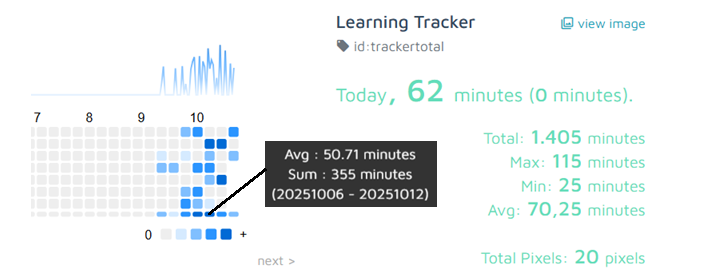
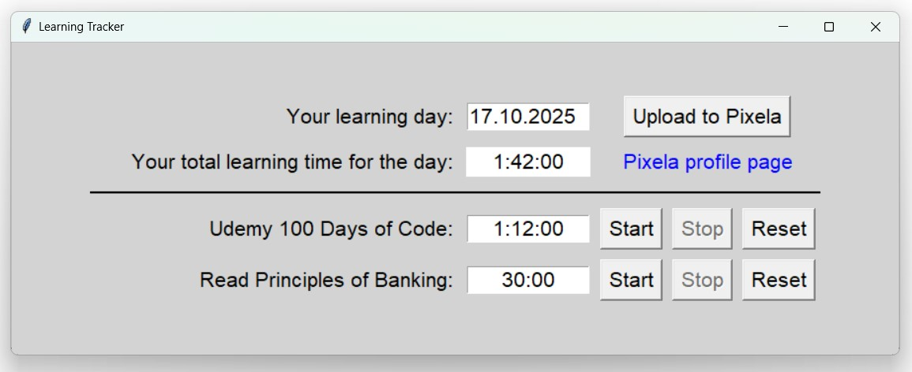
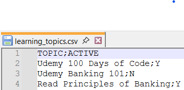

# Introducing the Learning Tracker
**Turn your study time into motivation!**

**Learning Tracker** is a Python-based GUI application, inspired by the [100 Days of Code](https://www.udemy.com/course/100-days-of-code/) online course, that lets you interact with your [Pixela](https://pixe.la/) profile.
Its main purpose is to track, in minutes, how much time you spend on your learning topics each day.

With the Pixela visualization, you can spot your strongest learning days of the week or follow your progress over time — and see if it’s time to put in a bit of extra effort next week to make up for those recent party days.

In the visualization, each “pixel” represents one day’s progress - learning time in minutes. This is an example of my learning tracker since July (I obviously had a very relaxing sommer 😎):

 

**Keep on learning! 🚀**

# Features
## Explain me the GUI
 
The GUI has two sections divided by a line:  

In the first section above the line, you see the current learning day and total learning time in hours, minutes and seconds as a sum of individual learning topics below for the day. From here, you can also upload your day to Pixela or visit your Pixela profile page. 

The second section below the line contains the individual learning topics that you are currently working on.

## Where do I get my learning topics from?
- On running 'main.py', the app assumes Today as your learning day and reads the 'learning_topics.csv' file that expects the following content: 

- Only the topics with 'ACTIVE = Y' will be loaded. This lets you disable the topic after you finished learning it
- On top of that, the app loads a topic from your Pixela tracker graphs if you have a pixel for the current learning day in any of your tracker graphs. This lets you check or update learning for previous days.

## What can I do with the GUI?
- You can load your learning stats and topics for any day in the past by typing the desired date into the learning day input box and pressing ENTER. The GUI is then reloaded with the desired day.
- After your learning topics are loaded, click on Start next to the right topic, the timer starts running and you can now enjoy learning
- You can Stop, Start again or Reset the timer anytime
- When the timer is not running, you can manually enter time for the topic (e.g. in case you forget to start it)
- Total learning time is an automatic sum of all of the day's learning time
- After your learning session is finished, click on 'Upload to Pixela' and your learning data gets uploaded

## What and how gets to my Pixela page?
- When creating a Pixela profile using the setup script from the installation and set-up section below, a TotalTracker graph is created that contains the sum of all the day's learnings.
- For every new learning topic, a new Pixela graph is automatically created when uploading to Pixela (graph id starts with 'tr-' in order not to interfere with your existing graphs). You can change the details of your graphs (e.g. color or timezone) in the create_graph() in pixela.py file
- When clicking 'Upload to Pixela,' all graphs loaded as learning topics are getting a pixel for the day + TotalTracker graph gets a pixel as sum of all topics learned today
- if you had 00:00 as learning time for the day, the Upload issues a delete pixel command for the topic or TotalTracker graph. This makes sure your statistics for learning topics are not distorted by uploading zeros for days when you don't learn the topic.
- Before initiating the Pixela upload, you can enter a comment for the day when Uploading to Pixela. The comment is created only for the TotalTracker graph. It lets you capture e.g. a rating for the day or number of pages you read.

# Installation and Setup
- Download the entire project code to your computer and unzip files locally.
- Install the following packages that are not part of the standard Python installation (which is also a pre-requisite of course) by running the code below in the Python terminal:
    - pip install requests
    - pip install pandas
    - pip install python-dotenv
- Enter your desired Pixela username and token (password) in the .env file
- Open the pixela.py file in your Python editor, uncomment the last line (create_user()) and run the code. You should see messages in your terminal that your User and Learning Tracker total graph was successfully created. This will also pin your Learning Tracker total graph to your Pixela profile page.
- Comment out the last line in the pixela.py again, save and close the file.
- Click on main.py to run the Learning Tracker app.
- If you see this message in the console of the main.py: 'Please retry this request,' please repeat the action. Your request for some APIs will be rejected 25% of the time because you are not a Pixela supporter. I recommend becoming a Pixela supporter if you would like to use the Learning Tracker on daily basis (costs 1 EUR per month). Don't forget to update the Pixela thanks code in the .env file in order to unlock limited Pixela features and disable the 25% APIs requests rejects.

# Q&A: What's on your mind?
**Q:** Your app is amazing, I would like to go on a date with you. Are you single? 
**A:** Thanks for asking, but no. Actually the question itself can get me into trouble. Fortunately my wife is not a regular visitor of GitHub 😄
